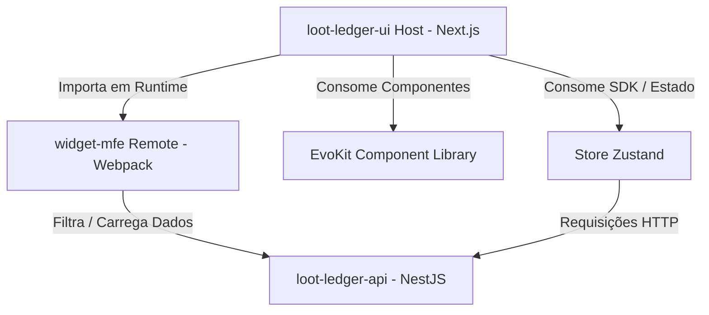

# Loot Ledger // Terminal Operations

[](https://nx.dev)
[](https://nextjs.org)
[](https://nestjs.com)
[](https://module-federation.io/)

> **Loot Ledger** é um sistema de gerenciamento financeiro completo e otimizado desenvolvido para o **Tech Challenge da FIAP (Fase 1)**. Ele combina uma arquitetura robusta em monorepo, um micro-frontend remoto de widgets federados em tempo de execução, e uma interface inspirada na estética **Hacker/Terminal**.

---

## 🛠️ Arquitetura e Engenharia de Software

O ecossistema é gerenciado pelo **Nx Monorepo**, garantindo modularidade de código, alta escalabilidade e isolamento de dependências.



### 1. Frontend & Micro-Frontend (MFE)
* **Host Application (`apps/loot-ledger-ui`)**: Construído em **Next.js 16 (App Router)** e **React 19**, servindo como contêiner principal da aplicação.
* **Federated Remote (`apps/widget-mfe`)**: Um micro-frontend remoto construído com **Webpack** e **Module Federation** que expõe o painel e os cards de visualização analítica (gráficos de área, linha, barra e numéricos) de forma assíncrona.
* **Runtime Federation**: Integrado dinamicamente no navegador via `@module-federation/enhanced/runtime` para isolar a renderização do MFE e evitar incompatibilidades de compilação em tempo de servidor (SSR) do Next.js.
* **Component Library (`libs/evokit`)**: Nosso design system headless customizado baseado em Tailwind CSS v4.

### 2. Estado Global & UI Híbrida
* **Gerenciamento de Estado**: Centralizado em uma store reativa do **Zustand**, responsável por persistir buscas, filtros, paginação, resumo geral e a sincronização assíncrona com os widgets do MFE.
* **Cadastro Creatable (Combobox)**: Os inputs de Categoria (seleção única) e Subcategoria (múltipla seleção em chips) possuem a funcionalidade híbrida de digitação direta e criação dinâmica de novos itens na base.
* **Compactação de Grade**: Grid de transações otimizado com padding reduzido e exibição de múltiplas subcategorias em badges compactos acionados por dropdowns de visualização sob demanda.

### 3. Backend, uploads e Delivery Estático
* **API REST (`apps/loot-ledger-api`)**: Desenvolvida em **NestJS 11**, com arquitetura modular, controllers específicos e dados persistidos por contexto de usuário.
* **Armazenamento Binário de Anexos**: Upload de arquivos via payload Base64 convertidos no servidor e salvos de forma binária em disco.
* **Controller Dedicado de Uploads**: Para evitar conflitos de rotas estáticas com o prefixo global `/api` do NestJS, criamos um endpoint dedicado `@Get('uploads/:filename')` que lê os arquivos físicos e os serve com segurança via `res.sendFile()`.

### 4. Otimizações de Performance, SSR e SEO
* **SSG (Static Site Generation)**: A tela pública de `/login` é estática e pré-compilada em tempo de build (`force-static`) para carregamento instantâneo.
* **Otimização de Fontes**: Inclusão de fontes via `next/font/google` eliminando requisições extras do Google Fonts e erradicando o flash de fonte (FOUT).
* **Streaming SSR com Suspense**: Divisão de layouts em Server/Client components. O esqueleto estrutural da página é enviado pelo servidor imediatamente, e o conteúdo dinâmico é renderizado conforme os dados chegam.
* **SEO Técnico**: Geração automatizada do arquivo `sitemap.xml` para indexação pública e regras restritivas no `robots.txt` para proteger as rotas privadas `/ledger/*`.

---

## 🚀 Como Executar o Projeto

Certifique-se de ter o **Node.js (v20+)** instalado.

### 1. Clonar e Instalar
```bash
# Clone o repositório
git clone <url-do-repositorio>

# Entre na pasta
cd loot-ledger

# Instale as dependências
npm install
```

### 2. Configurar Variáveis de Ambiente
Criamos um arquivo de ambiente na raiz do monorepo para unificar os caminhos locais:
Copie o conteúdo do `.env.example` (ou crie um arquivo `.env` na raiz) com a porta de cada serviço local:
```env
NEXT_PUBLIC_API_URL=http://localhost:3001/api
NEXT_PUBLIC_WIDGET_MFE_URL=http://localhost:4200/mf-manifest.json
NX_PUBLIC_API_URL=http://localhost:3001/api
```

### 3. Rodar o Ambiente de Desenvolvimento
Rode todo o ecossistema (UI Next.js, API NestJS e Nginx/Webpack do MFE) com apenas um comando:
```bash
npm run dev
```

* **Frontend UI (Next.js)**: `http://localhost:3000`
* **Backend API (NestJS)**: `http://localhost:3001/api`
* **Widgets MFE (Remote Webpack)**: `http://localhost:4200`

---

## 📂 Estrutura de Pastas

```text
apps/
  ├── loot-ledger-api/    # Backend NestJS (API Rest e Upload Controller)
  ├── loot-ledger-ui/     # Frontend Next.js (App Router, Zustand Store, SSR/SSG Pages)
  └── widget-mfe/         # Remote Micro-Frontend (Cards Analíticos de Widgets e Webpack)
libs/
  └── evokit/             # Design System Headless (Radix UI + Tailwind CSS v4)
```

---

Desenvolvido como parte do **Postech - Tech Challenge da FIAP**.

_SYSTEM_STATUS: OPERATIONAL // LEDGER_SYNC: OK // FEDERATION: ONLINE_

